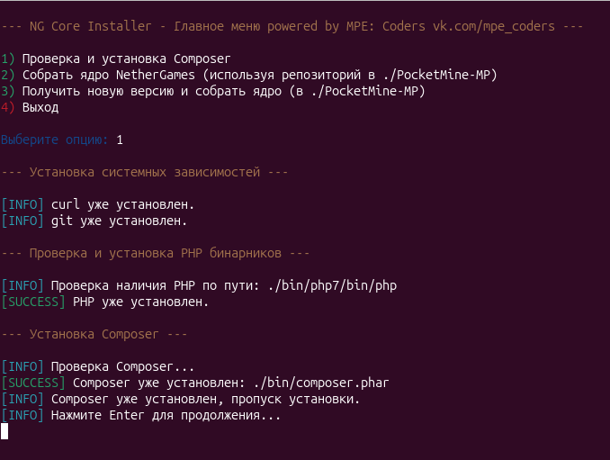

# 🚀 NG Core Installer


<p align="center">
  
  <br>
  <em>Пример работы скрипта</em>
</p>

## ✨ Описание Проекта

**NG Core Installer** — это интерактивный Bash-скрипт, разработанный для упрощения процесса установки необходимых зависимостей, загрузки и сборки ядра PocketMine-MP от [NetherGamesMC](https://github.com/NetherGamesMC/PocketMine-MP). Он автоматизирует рутинные шаги, такие как установка PHP бинарников, Composer и клонирование/обновление репозитория NetherGames, предоставляя удобное меню для выбора действий.

Цель скрипта — сделать процесс подготовки сервера NetherGames максимально быстрым и безболезненным, особенно для новичков или при частой переустановке/обновлении.

## 🌟 Возможности

*   **Интерактивное меню:** Удобный интерфейс командной строки для выбора действий.
*   **Автоматическая установка зависимостей:** Проверяет и устанавливает `curl` и `git`, если они отсутствуют.
*   **Установка PHP бинарников:**
    *   Автоматически определяет, установлен ли PHP в нужной директории (`./bin/php7/bin`).
    *   Если нет, скачивает и распаковывает актуальные PHP бинарники для PM5 (PHP 8.2) в папку `./bin`.
    *   Удаляет временные файлы после установки.
*   **Установка Composer:**
    *   Проверяет наличие `composer.phar` в `./bin`.
    *   Если отсутствует, скачивает и устанавливает Composer, используя установленный PHP.
    *   Удаляет временные файлы установщика Composer.
*   **Управление репозиторием NetherGames:**
    *   Клонирует репозиторий [NetherGames/PocketMine-MP](https://github.com/NetherGamesMC/PocketMine-MP) в отдельную папку `./PocketMine-MP`, предотвращая конфликты с файлами в корневой директории.
    *   Позволяет обновить существующий репозиторий через `git pull`.
    *   После клонирования/обновления автоматически устанавливает Composer зависимости для сборки ядра.
*   **Сборка ядра NetherGames:**
    *   Использует `composer make-server` для сборки актуальной версии `PocketMine-MP.phar`.
    *   Сообщает о местоположении собранного файла.
*   **Чистота и безопасность:** Репозиторий проекта располагается в собственной папке, что минимизирует риск случайного удаления пользовательских файлов.
*   **Информативный вывод:** Использует цветовое кодирование и детальные сообщения для каждого шага.

## 🚀 Быстрый старт (One-liner)

Хотите быстро попробовать? Подключитесь по **SSH** к серверу и выполните одну из команд:

### Вариант 1 (рекомендуемый):
```bash
bash <(wget -qO - https://raw.githubusercontent.com/MPE-Coders/NG-Core-Installer/main/ng_installer.sh)
```

### Вариант 2 (с curl):
```bash
bash <(curl -sSL https://raw.githubusercontent.com/MPE-Coders/NG-Core-Installer/main/ng_installer.sh)
```

**Важно:** Перед запуском убедитесь, что вы понимаете, что делает эта команда. Она скачивает и сразу выполняет скрипт с GitHub. Для большей безопасности рекомендуется сначала скачать скрипт, проверить его содержимое, а затем запустить.

---

## ⬇️ Установка и Запуск (Обычный способ)

1.  **Клонируйте репозиторий:**
    ```bash
    git clone https://github.com/MPE-Coders/NG-Core-Installer.git
    cd NG-Core-Installer
    ```

2.  **Сделайте скрипт исполняемым:**
    ```bash
    chmod +x ng_installer.sh
    ```

3.  **Запустите скрипт:**
    ```bash
    ./ng_installer.sh
    ```

После запуска появится интерактивное меню. Следуйте инструкциям на экране.

---

### **Пояснение к командам быстрого старта:**

**Вариант 1 (`sh <(wget -qO - ...)`) — самый безопасный:**
- `wget -qO -` — скачивает файл тихо (`-q`) и выводит в stdout (`-O -`)
- `sh <(...)` — передает вывод напрямую в оболочку без сохранения на диск

**Вариант 2 (`sh <(curl -sSL ...)`) — аналог первого варианта с curl:**
- `curl -sSL` — тихий режим с поддержкой редиректов
- Подходит для систем, где нет wget

### **Преимущества такого подхода:**
1. **Безопасность:** Скрипт не сохраняется на диск (в варианте 1 и 2)
2. **Актуальность:** Всегда запускается последняя версия с GitHub
3. **Простота:** Одна команда для быстрого тестирования
4. **Гибкость:** Можно легко обновить скрипт, просто перезапустив команду


## 🙏 Благодарности

Этот скрипт был бы невозможен без работы и вклада следующих проектов и сообществ:

*   **[PHP](https://www.php.net/)** — фундаментальный язык программирования, на котором работает PocketMine-MP и весь стек.
*   **[Composer](https://getcomposer.org/download/)** — менеджер зависимостей для PHP, незаменимый инструмент для управления библиотеками и сборки сложных PHP-проектов.
*   **[PocketMine-MP (PMMP)](https://github.com/pmmp/)** — за предоставление официальных PHP-бинарников ([PHP-Binaries](https://github.com/pmmp/PHP-Binaries)) и оригинальной версии ядра PocketMine-MP ([PocketMine-MP](https://github.com/pmmp/PocketMine-MP)), которые служат основой для многих серверов Minecraft: Bedrock Edition.
*   **[NetherGamesMC](https://github.com/NetherGamesMC/PocketMine-MP)** — за разработку и поддержку модифицированного ядра PocketMine-MP, адаптированного для нужд сообщества NetherGames.

## 🤝 Вклад

Мы приветствуем любые вклады, будь то сообщение об ошибке, предложение по улучшению или новый функционал!

1.  Сделайте форк репозитория.
2.  Создайте новую ветку (`git checkout -b feature/AmazingFeature`).
3.  Внесите изменения и закоммитьте их (`git commit -m 'Add some AmazingFeature'`).
4.  Отправьте изменения в вашу ветку (`git push origin feature/AmazingFeature`).
5.  Откройте Pull Request.

Пожалуйста, убедитесь, что ваш код соответствует текущему стилю и что все новые функции протестированы.

## 📄 Лицензия

Этот проект распространяется под лицензией **Creative Commons Attribution-NonCommercial 4.0 International (CC BY-NC 4.0)**.

Вы можете свободно использовать, модифицировать и распространять этот скрипт для некоммерческих целей, при условии указания авторства. Продажа или иное коммерческое использование без явного разрешения автора запрещено.

Для получения дополнительной информации см. файл [LICENSE](LICENSE) или посетите [https://creativecommons.org/licenses/by-nc/4.0/](https://creativecommons.org/licenses/by-nc/4.0/).

## 📞 Контакты

Если у вас есть вопросы или предложения, не стесняйтесь открывать issue в этом репозитории.

---

**[MPE: Coders]** - [@MPE_Coders](vk.com/mpe_coders) - (VK Group)

**[MPE: Coders]** - [@MPE_Coders](t.me/mpe_coders) - (Telegram Group)

**[XackiGiFF]** - [@XackiGiFF](github.com/XackiGiFF) - (github DevOps)

Ссылка на репозиторий: [https://github.com/MPE-Coders/NG-Core-Installer](https://github.com/MPE-Coders/NG-Core-Installer)

---